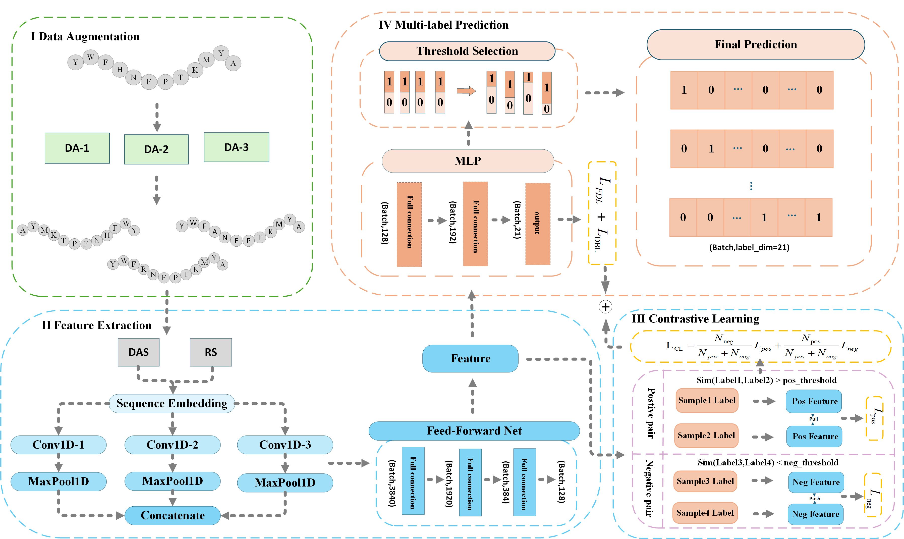

# AMCL
Supervised contrastive learning with hard sample mining for multi-functional therapeutic peptide prediction
##  Introduction
we propose AMCL, an innovative framework for MTP prediction with several key contributions.  
(1) We introduce a novel semantic-preserving data augmentation strategy that integrates back-translation substitution, sequence reversal, and random replacement of similar amino acids. This strategy expands the dataset while effectively preserving the structural integrity of peptide sequences;   
(2) By combining multi-label supervised contrastive learning with hard sample mining, our framework adaptively focuses on difficult samples. This enhances feature learning and boosting the model's discriminative power across functional categories;  
(3) We propose a weighted combined loss that combines Focal Dice Loss (FDL) and Distribution-Balanced Loss (DBL). This strategy mitigates class imbalance and enhancing both model performance and generalization capabilities;  
(4) We introduce a category-adaptive threshold selection mechanism that assigns independent decision thresholds for each functional category, enhancing prediction accuracy and reliability. Experimental results demonstrate that AMCL significantly outperforms existing methods, achieving notable improvements across multiple evaluation metrics.  

The framework of the PSCFA method for MFTP prediction is described as follows:  

##  Related Files  
###   AMCL 
| FILE NAME       | DESCRIPTION                                                     |
|-----------------|-----------------------------------------------------------------|
| `pep_main.py`   | stores configuration and parameter settings for the AMCL model. |
| `train.py`      | train model                                                     |
| `train_test.py` | the main file of AMCL predictor                                 |
| `DA.py`         | data augmentation                                               |
| `estimate.py`   | evaluation metrics                                              |
| `models`        | model construction                                              |
| `losses.py`     | loss functions used to train models                             |
| `dataset`       | data                                                            |
| `result`        | results preserved during training.                              |
| `saved_models`  | models preserved during training.                               |


## Installation
- **Requirements**
    OS:  
     - **Windows**: Windows 10 or later  
     - **Linux**: Ubuntu 16.04 LTS or later

    Python Environment：    
    Ensure your Python environment is compatible with the specified library versions:  
    - `Python= 3.10`
    - `pytorch=2.5.1`
    - `cuda=12.4`
    - `numpy=1.22.4`
    - `pandas=2.2.2`
- **Download `AMCL` to your computer:**
   ```bash
   git clone https://github.com/xialab-ahu/AMCL.git
   ```
- open the dir and install `requirement.txt` with `pip`
- 
  ```
  cd AMCL
  pip install -r requirement.txt
  ```
##  Training and test AMCL model  
   ```shell
   cd "./AMCL"
   python pep_main.py
```
##  Contact
Please feel free to contact us if you need any help.
